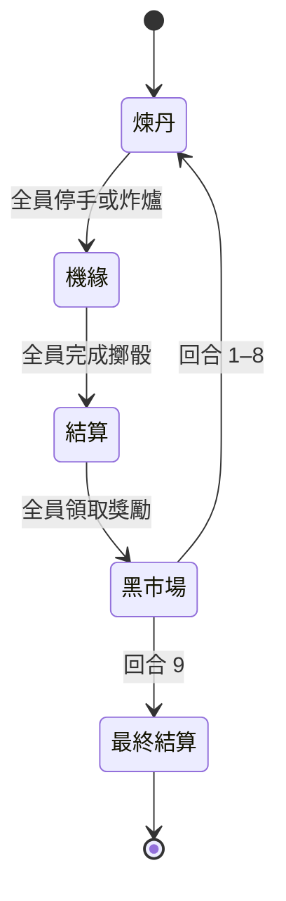

# Game Flow

```mermaid
stateDiagram-v2
  [*] --> 煉丹
  煉丹 --> 機緣: 全員停手或炸爐
  機緣 --> 結算: 全員完成擲骰
  結算 --> 黑市場: 全員領取獎勵
  黑市場 --> 煉丹: 回合 1–8
  黑市場 --> 最終結算: 回合 9
  最終結算 --> [*]
```

程式入口為 `src/game/engine.ts`。狀態更新回傳新的 `GameState`，方便日後加入重播、存檔和多人同步。
